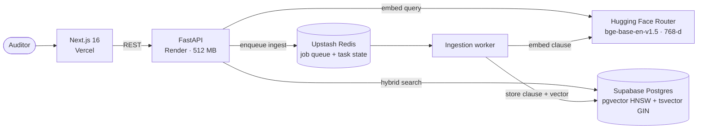

# Enterprise Audit Copilot

An SLA audit workspace for logistics contracts. It sets shipment telemetry (transit time, cold-chain readings, damage reports) against the vendor's own contract. Hybrid retrieval finds the governing clause, the penalty the clause specifies is applied to the shipment's telemetry, and a citable breach notice is drafted.

**Stack:** Next.js 16 · FastAPI · PostgreSQL + pgvector · Redis · Hugging Face Inference Router

---

## Architecture



| Layer | Responsibility |
|---|---|
| **Next.js** | Reconciliation workspace, shipments and contracts views. Applies the penalty terms written in the cited clause (tiered delay, temperature excursion, damage at cost) instead of hardcoded rates. |
| **FastAPI** | Stateless API: `/api/retrieve`, `/api/shipments`, `/api/contracts`, `/api/ingest/async`, `/api/tasks/{id}`. |
| **Postgres** | One store for relational records, dense vectors (HNSW, cosine) and lexical search (generated `tsvector`, GIN). |
| **Redis + worker** | Contract ingestion runs outside the request path: the API returns `202` with a task ID, and the worker embeds and stores the clause. |

**Retrieval** takes up to 10 candidates from each of two searches (pgvector cosine similarity and Postgres full-text), merges them, ranks by `0.6 · vector + 0.4 · lexical`, and returns the top 3 with both scores visible for audit.

---

## The core constraint: a 512 MB RAM ceiling

The API runs on Render's 512 MB tier. A local embedding model (FastEmbed/ONNX `bge-base`) together with the Python runtime and the connection pools comes close to that ceiling. That risks the container being killed for running out of memory in the middle of a request.

**Decision:** move dense embedding off the box to the Hugging Face Inference Router, so the API process holds no model weights. Postgres full-text search is kept as an automatic fallback, so retrieval never depends on the embedding service being up.

Every request takes the best embedding path available:

| Priority | Embedding path | When it's used | API RAM for embedding | Retrieval quality |
|---|---|---|---|---|
| 1 | Remote: HF Router | `HF_TOKEN` is set | ~0 MB | Hybrid (semantic + lexical) |
| 2 | Local: FastEmbed on onnxruntime | `ENABLE_LOCAL_EMBEDDINGS=true` | Model weights in process | Hybrid (semantic + lexical) |
| 3 | None | Neither is available | 0 MB | Lexical only (Postgres FTS) |

**Trade-offs accepted:**
- **Latency and a third-party dependency.** Each query makes a network call to embed. Production retrieval measured roughly 2.5–5 s end to end in spot checks, against about 0.4 s for lexical-only search locally. If the router fails or times out (10 s), the request drops to lexical search instead of returning an error.
- **Lexical-only mode is a strict matcher.** `websearch_to_tsquery` requires every search term to match, so long natural-language questions can return nothing without embeddings. This is why the fallback is a safety net, not the main search path.
- **Ingestion degrades without losing data.** When no embedding is available, the worker stores the clause with a `NULL` vector. Lexical search finds it immediately, and `backfill_embeddings.py` fills in the vector later.

---

## Two modes: hermetic local dev, zero-cost cloud

The application code is identical in both modes. Only environment variables change.

| | **Local: Docker Compose** | **Cloud: managed services** |
|---|---|---|
| Frontend | `next dev` on :3000 | Vercel |
| API | `api` container on :8000 (code hot-mounted) | Render web service |
| Database | `pgvector/pgvector:pg16` container | Supabase Postgres (pooler) |
| Queue | `redis:7-alpine` container | Upstash Redis |
| Embeddings | onnxruntime in the container (`ENABLE_LOCAL_EMBEDDINGS=true`) or lexical only | HF Router (`HF_TOKEN`) |
| External calls | None needed: runs fully offline | HF, Supabase, Upstash |
| Cost | Local machine | Free tiers |

Local mode needs no accounts and no network access, and every setup starts from the same schema and seed data. Cloud mode swaps each container for a managed free-tier equivalent.

---

## Quickstart (local)

```bash
# 1. Start Postgres, Redis, API and worker
docker compose up -d --build

# 2. Create the schema (not applied automatically)
docker compose exec -T db psql -U audit_admin -d audit_db < backend/init.sql
#    PowerShell: Get-Content backend/init.sql | docker compose exec -T db psql -U audit_admin -d audit_db

# 3. Seed the sample contract and shipments from ./data
docker compose exec api python -m app.pipeline

# 4. Run the frontend
cd frontend
echo "NEXT_PUBLIC_API_URL=http://localhost:8000" > .env.local
npm install && npm run dev
```

For semantic search locally, set `ENABLE_LOCAL_EMBEDDINGS=true` (runs offline, uses more memory) or `HF_TOKEN` on the `api` and `worker` services, then run `docker compose exec api python -m app.backfill_embeddings`. With neither set, the stack runs in lexical-only mode.

For the cloud deployment, set `DATABASE_URL` (Supabase), `REDIS_URL` (Upstash) and `HF_TOKEN` on Render, and `NEXT_PUBLIC_API_URL` on Vercel. If the API can't be reached, the frontend switches to labelled demo data instead of failing.

---

## Known gaps

- **No reranker.** `flashrank` is a dependency, but no code uses it yet.
- **No authentication** on the API. CORS is open to all origins.
- The shipments table has no cold-chain or carton-count columns yet. Those signals come from the demo dataset or the carrier's notes.
